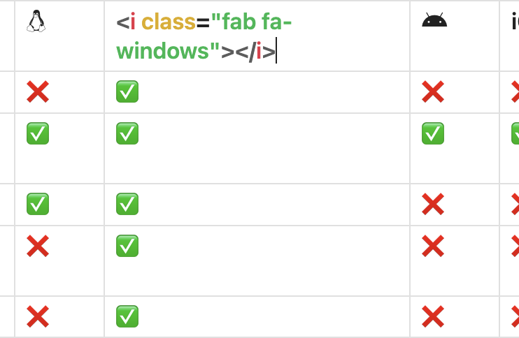

# Font Awesome for Obsidian

Adds Font Awesome (free version 6.7.2 by [@fontawesome](https://fontawesome.com)) icons to Obsidian.

## Usage

1. Install the plugin
2. Insert the icon, e.g. `<i class="fab fa-linux"></i>`

## Future Updates
- [ ] Search for icons

